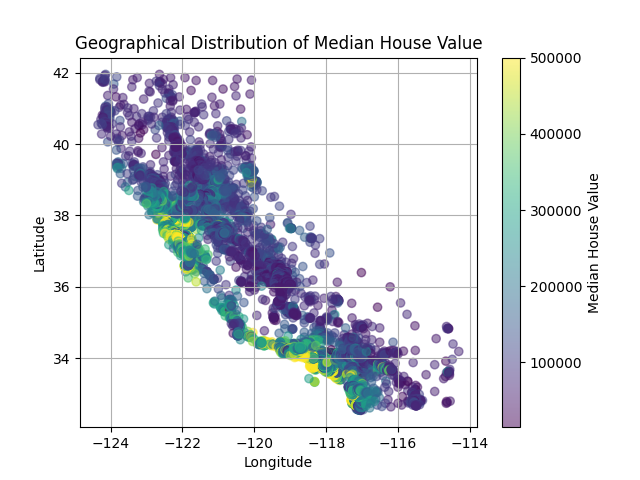
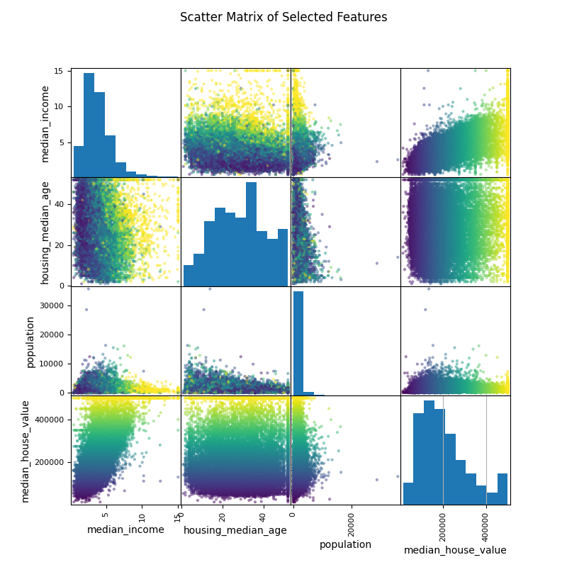
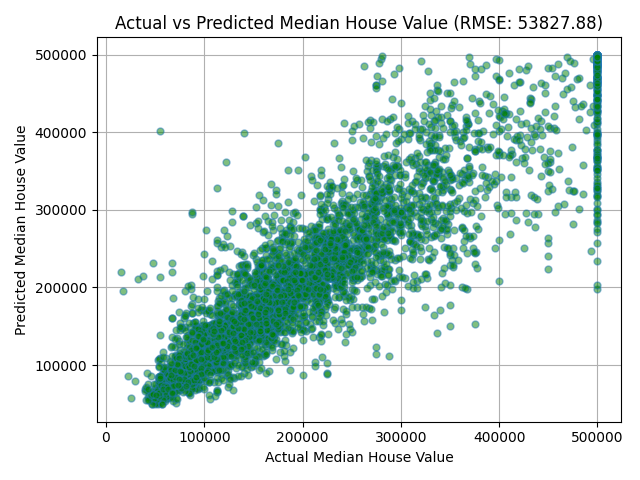

# 🏡 California Housing Price Prediction

A beginner-friendly data science project that predicts median house prices across California districts using Scikit-Learn and Matplotlib. This project covers the complete data science workflow — from data preprocessing and visualization to model building and evaluation.


---

## 📌 Features

- 🔍 **Exploratory Data Analysis (EDA)** using `pandas` and `matplotlib`
- 🧼 **Data Preprocessing**: Handling missing values, categorical encoding, and feature scaling
- 🏗️ **Model Training**: Linear Regression, Decision Tree Regressor, and Random Forest Regressor
- ✅ **Model Evaluation**: Root Mean Squared Error (RMSE) and cross-validation
- 📊 **Visualization**: Correlation matrix, histograms, scatter plots, and actual vs predicted comparisons


---

## 🛠️ Tech Stack

| Purpose            | Library         |
|--------------------|-----------------|
| Data Handling      | `pandas`, `numpy` |
| Visualization      | `matplotlib`     |
| Machine Learning   | `scikit-learn`   |

---

## 📊 Results

- Best Performing Model: **Random Forest Regressor**
- Evaluation Metric: **Root Mean Squared Error (RMSE)**
- Models compared based on accuracy and visual analysis

---
## 📈 Visual Output

Graphs are auto-generated using `visualization.py` and saved in the `images/` folder.

### Latitude vs Longitude Scatter Matrix


### Scatter Matrix


### Actual vs Predicted Comparison

## 🚀 Getting Started

```bash
# Clone the repository
git clone https://github.com/Mr-Mysterious001/California_housing_prices_project.git
cd California_housing_prices_project

# (Optional) Create and activate virtual environment
python -m venv venv
source venv/bin/activate    # On Windows: venv\Scripts\activate

# Install dependencies
pip install -r requirements.txt

# Run the project
python main.py


